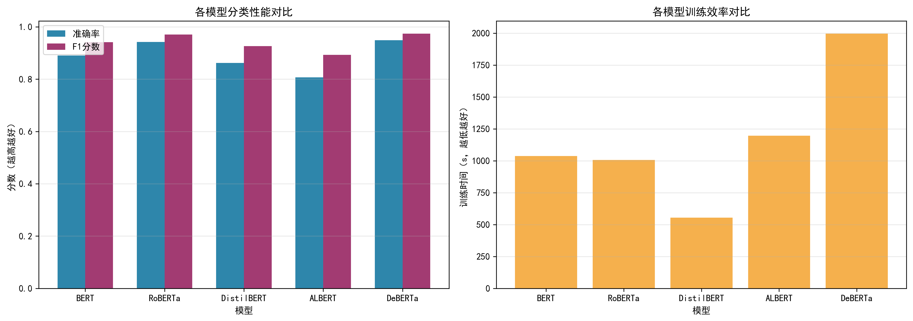

# IMDB电影评论情感分类：5种预训练语言模型对比


一个基于IMDB数据集的情感分类项目，系统对比了BERT、RoBERTa、DistilBERT、ALBERT、DeBERTa 5种主流预训练语言模型的性能与效率，为不同场景下的模型选型提供实证依据。

## 🌟 项目亮点
- **全面对比**：覆盖5种主流预训练模型，统一实验设置确保公平性
- **完整流程**：从数据加载、分词处理、模型训练到评估可视化，全流程可复现
- **实用工具**：提供训练脚本+单条评论预测脚本，支持快速部署
- **可视化报告**：自动生成性能对比图表，直观呈现模型优劣

## 📋 实验结果
### 模型性能与效率汇总
| 模型         | 准确率   | F1分数  | 训练时间(s) |
|--------------|----------|---------|-------------|
| DeBERTa      | 0.9491   | 0.9739  | 1995.68     |
| RoBERTa      | 0.9428   | 0.9706  | 1006.87     |
| BERT         | 0.8903   | 0.9420  | 1037.71     |
| DistilBERT   | 0.8625   | 0.9262  | 554.47      |
| ALBERT       | 0.8070   | 0.8932  | 1197.08     |

### 性能对比图


### 关键结论
- **最优性能**：DeBERTa凭借解耦注意力机制，准确率达94.91%，适合高精度需求场景
- **均衡选择**：RoBERTa性能接近DeBERTa（94.28%），训练时间仅1006s，兼顾性能与效率
- **高效轻量**：DistilBERT训练时间减少47%，适合资源受限环境（如边缘设备）
- **基准参考**：BERT作为经典模型，仍保持89.03%准确率，适合入门学习与基线测试

## 🚀 快速开始
### 1. 环境配置
```bash
# 克隆仓库
git clone https://github.com/DingYouGang123/IMDB-Sentiment-Classification.git
cd IMDB-Sentiment-Classification

# 安装依赖
pip install -r requirements.txt
```

### 2.运行训练
```bash
python src/train_imdb.py
```
训练过程可通过 SwanLab 可视化（运行后按终端提示访问链接）
结果文件（CSV + 图表）将保存至./results目录

### 3.单条评论预测
```bash
# 使用训练好的模型（以DeBERTa为例）预测评论情感
python predict.py --model_path ./results/deberta-v3-base --comment "This movie is amazing! I love every minute of it."
```
输出示例：
```plaintext
✅ 模型加载成功！

📝 输入评论：This movie is amazing! I love every minute of it.
❤️  预测情感：正面
```

## 🎯 超参数调优
针对RoBERTa模型（性能与效率均衡）进行超参数自动搜索，优化核心指标为准确率。

### 调优功能
- 搜索超参数：学习率（1e-5~1e-4）、批量大小（4/8/16）、权重衰减（0.01~0.2）、预热比例（0.05~0.2）
- 自动剪枝：性能不佳的实验提前终止，节省计算资源
- 结果保存：自动输出最优超参数组合及测试集最终性能

### 运行调优
```bash
# 启动超参数搜索（共10轮，可修改num_trials调整）
python src/tune_hyperparameters.py
```

## 📂 项目结构
```plaintext
IMDB-Sentiment-Classification/
├── src/
│   └── train_imdb.py            # 核心训练脚本（数据处理+模型训练+评估）
│   └── tune_hyperparameters.py  # 调参脚本
├── predict.py                   # 单条评论预测脚本
├── requirements.txt             # 依赖包清单
├── README.md                    # 项目说明文档
└── results/                     # 自动生成：训练结果、可视化图表、模型文件
```

## 🔧 核心功能说明
1. 数据处理
自动加载 IMDB 数据集（5 万条评论）
按 2:1:1 分割为训练集 / 验证集 / 测试集
适配不同模型的 Tokenizer，统一序列长度为 512
2. 模型训练
统一训练参数（学习率 2e-5、3 轮训练、批量大小 8）
支持自动保存最优模型、训练日志跟踪
多维度评估指标（准确率 / 精确率 / 召回率 / F1）
3. 结果可视化
自动生成性能对比柱状图
保存结果到 CSV 文件，支持后续分析

## 📌 技术栈
深度学习框架：PyTorch
预训练模型：Hugging Face Transformers
数据处理：Datasets、Pandas、NumPy
评估指标：Scikit-learn
可视化工具：SwanLab、Matplotlib

## 🎯 适用场景
NLP 入门学习：了解预训练模型微调流程
情感分析任务：快速搭建基线模型
模型选型参考：不同场景下的模型选择依据
简历项目补充：完整的 NLP 项目案例（数据处理 + 模型 + 评估 + 可视化）

## 🙏 致谢
数据集来源：[IMDB Movie Reviews](https://huggingface.co/datasets/stanfordnlp/imdb)
模型框架：[Hugging Face Transformers](https://huggingface.co/docs/transformers/index)
实验跟踪：[SwanLab](https://swanlab.cn/)

## 📞 联系作者
如有问题或建议，欢迎提交 Issue 或联系：210810518@stu.hit.edu.cn